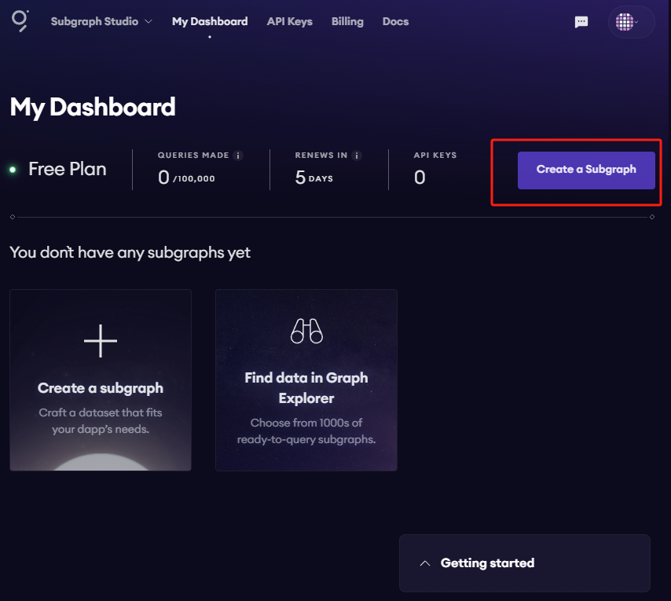
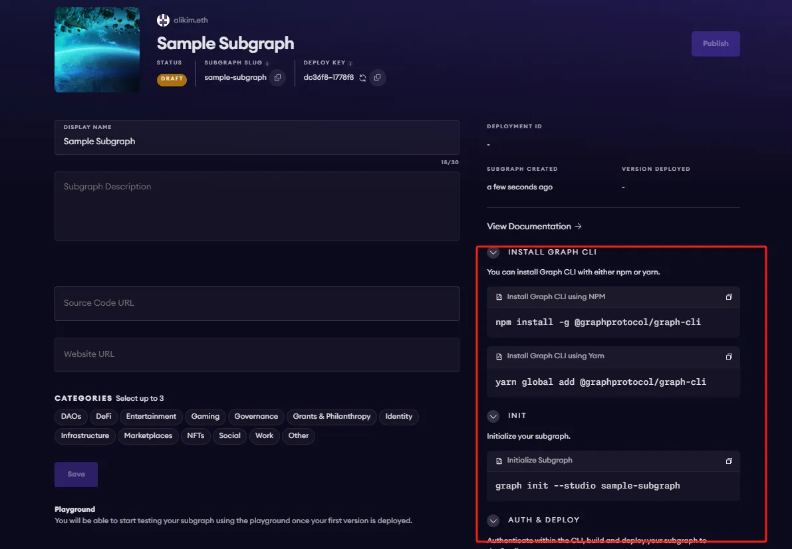

# kaia-wallet-tracker-subgraph
A subgraph tutorial for tracking wallet transactions on Kaia blockchain using The Graph Studio
# Creating a Subgraph for Kaia Blockchain using The Graph Studio

This tutorial demonstrates how to build a subgraph for Kaia blockchain data using The Graph Studio, providing a powerful tool for tracking wallet transactions.

## Prerequisites
- **The Graph Studio account** (Sign up at [The Graph Studio](https://thegraph.com/studio))
- **Kaia smart contract information** (contract address and ABI)
- **Graph CLI** (install via `yarn global add @graphprotocol/graph-cli`)

## Step-by-Step Guide
### Step 1: Setting Up the Project in The Graph Studio
1. Log in to The Graph Studio, then click **Create a Subgraph**.

   

2. Fill in the details for your subgraph, selecting the Kaia network.

   

### Step 2: Define Your Subgraph Schema
- Define the `Account` and `Transaction` entities in `schema.graphql` under the `subgraph/` folder.

   ```graphql
   type Account @entity {
     id: ID!
     balance: BigInt!
     transactions: [Transaction!] @derivedFrom(field: "from")
   }

   type Transaction @entity {
     id: ID!
     from: Account!
     to: Account!
     value: BigInt!
     timestamp: BigInt!
     type: String! # e.g., "send", "receive"
   }
```